SpatialFlow

  

<h1 align="center">SpatialFlow</h1>

  A modern open-source hybrid music player for Android that seamlessly combines local audio playback and online music streaming within a beautiful Material Design 3 Expressive experience.

  Built with Kotlin, Jetpack Compose, Media3, and modern Android architecture.

  <b>Hybrid Streaming • Material You • Dynamic Theming • Volume Normalization • Open Source</b>

  
  
  
  
  
  
  
  

  <a href="#features">Features</a> •
  <a href="#screenshots">Screenshots</a> •
  <a href="#architecture">Architecture</a> •
  <a href="#installation">Installation</a> •
  <a href="#roadmap">Roadmap</a> •
  <a href="#contributing">Contributing</a> •
  <a href="#license">License</a>

---

Project Status

SpatialFlow is actively maintained and continuously evolving.

Current development focus:

- Material Design 3 Expressive enhancements
- Streaming platform improvements
- Audio engine refinements
- Performance optimization
- Accessibility improvements
- Modern Android API adoption

---

About SpatialFlow

SpatialFlow is a next-generation Android music player designed to bridge the gap between local media libraries and online streaming services.

Built entirely with Kotlin and Jetpack Compose, the application leverages Android's latest technologies including Media3, Coroutines, StateFlow, Material Design 3 Expressive, and modern architecture principles to provide a smooth, reliable, and immersive listening experience.

Whether listening to locally stored high-fidelity audio files or streaming music online, SpatialFlow delivers premium playback through Media3, dynamic album-art-based theming, advanced audio processing, and a polished user experience optimized for modern Android devices.

---

Features

Music Library

- Automatic local media scanning
- Support for MP3, FLAC, AAC, WAV, OGG, M4A and common audio formats
- Fast search and filtering
- Smart album and artist organization
- Unified playback queue management

Online Streaming

- YouTube Music powered discovery
- Search songs, albums, artists and playlists
- Stream music without requiring an account
- Unified local and online playback experience
- Seamless media queue integration

Advanced Audio Engineering

Real-Time Volume Normalization

- LUFS-based loudness normalization
- Automatic gain adjustment
- Consistent listening volume across tracks
- Default target loudness: -14 LUFS

Playback Enhancements

- Gapless playback
- Custom crossfade transitions
- Smart queue management
- High-performance Media3 playback engine

Audio Effects

- Multi-band Equalizer
- Bass Boost
- Loudness Enhancer
- Environmental Reverb
- Audio balance controls
- Device audio session integration

Premium User Experience

Material Design 3 Expressive

- Fully Compose-based UI
- Expressive layouts and animations
- Spring physics interactions
- Responsive adaptive components

Dynamic Theming

- Real-time album art color extraction
- Dynamic Material You integration
- Adaptive color generation
- Personalized playback screens

Appearance

- AMOLED Pure Black Mode
- Dynamic navigation labels
- Modern onboarding experience
- Smooth loading animations
- Fluid transitions throughout the application

Performance

- Optimized memory management
- Reactive UI updates
- Coroutines-powered asynchronous operations
- Efficient image loading
- Fast library indexing
- Smooth scrolling and animations

---

Screenshots

  
  
  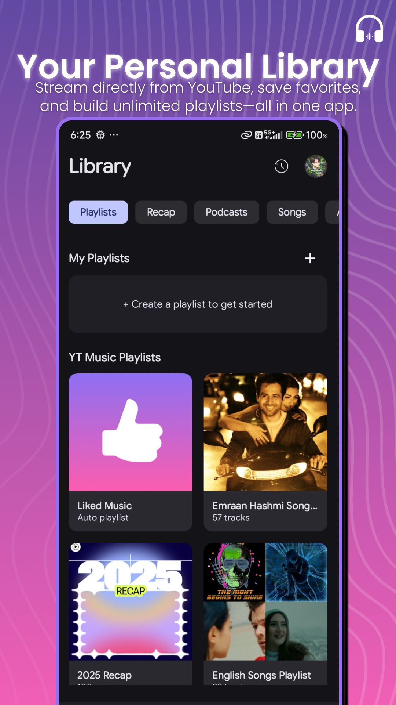

  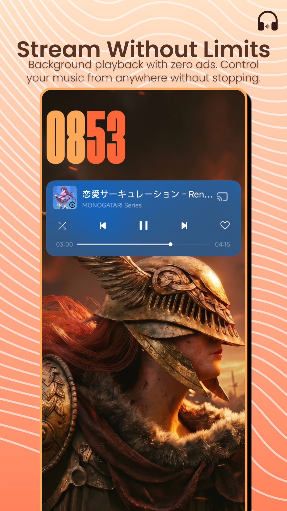
  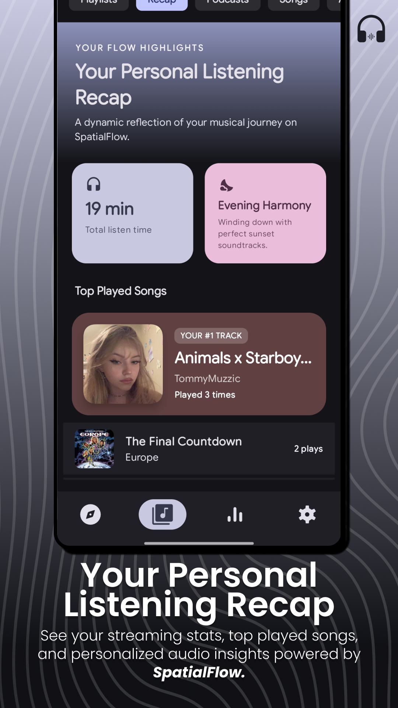
  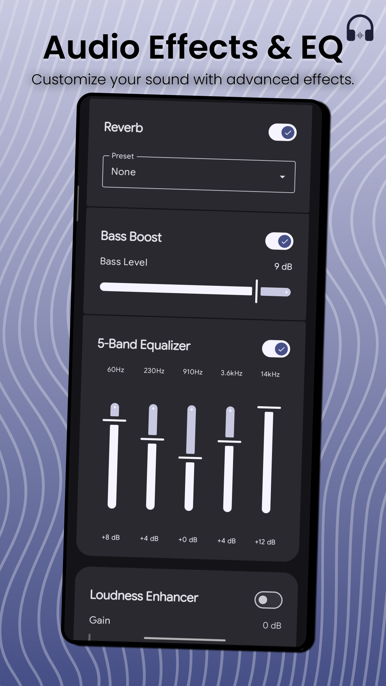

  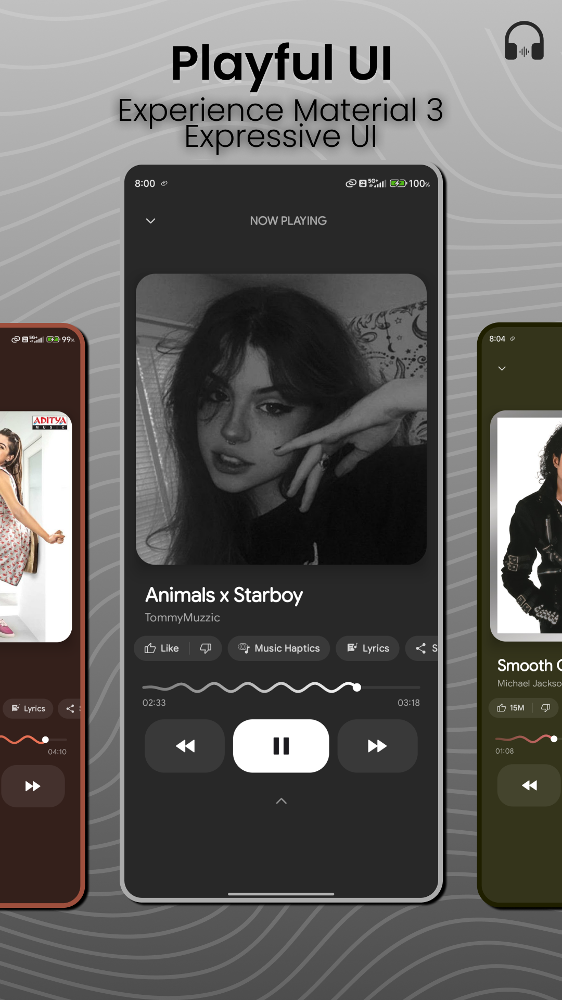
  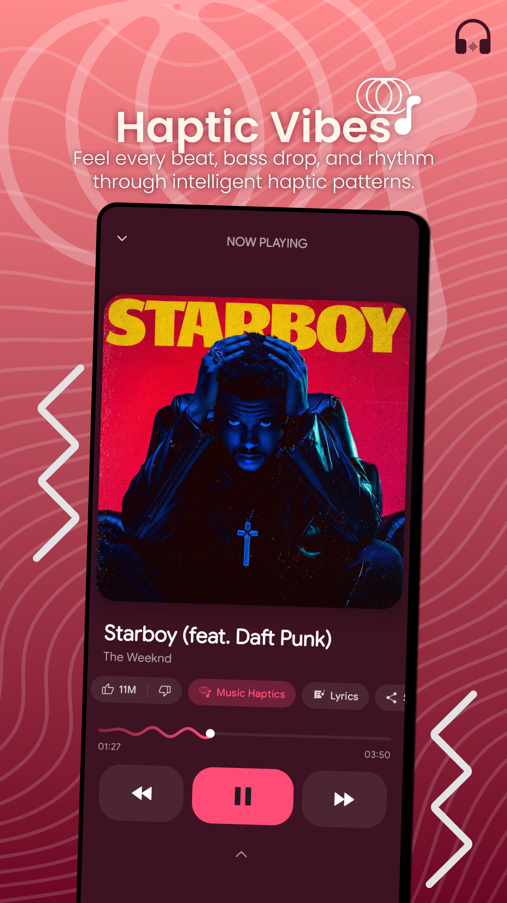
  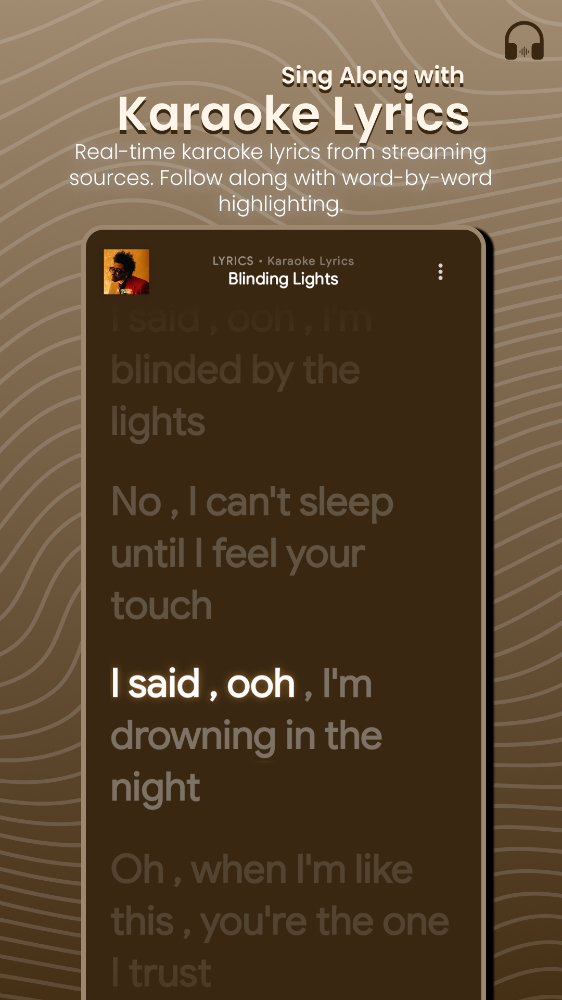

  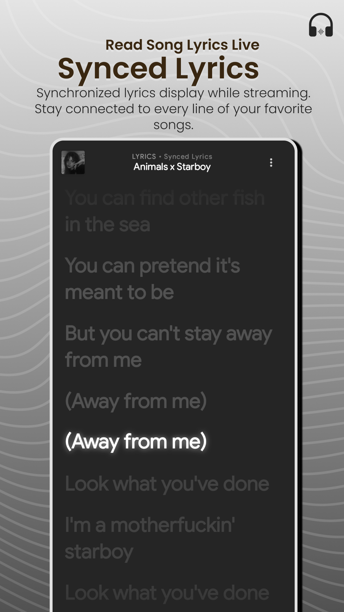
  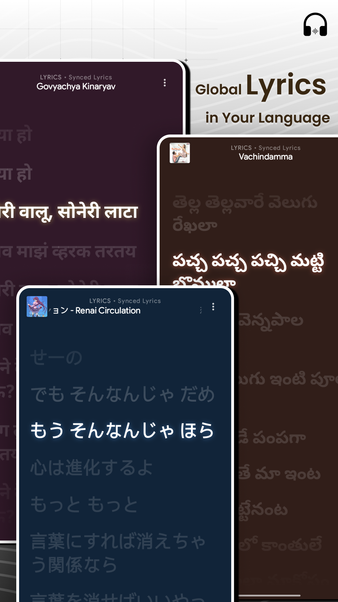
  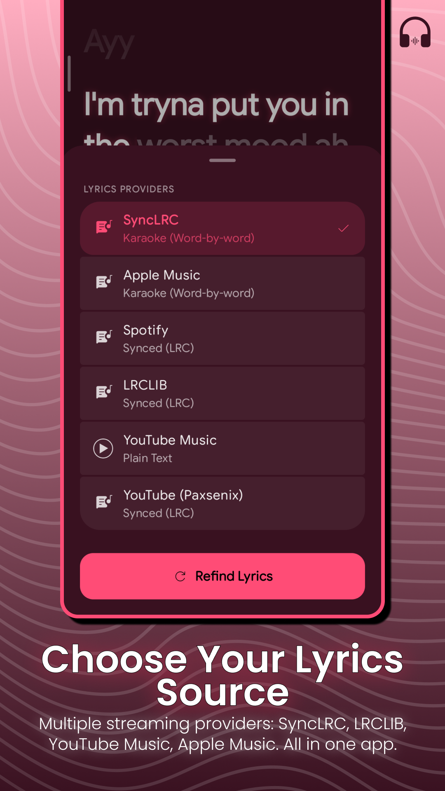

  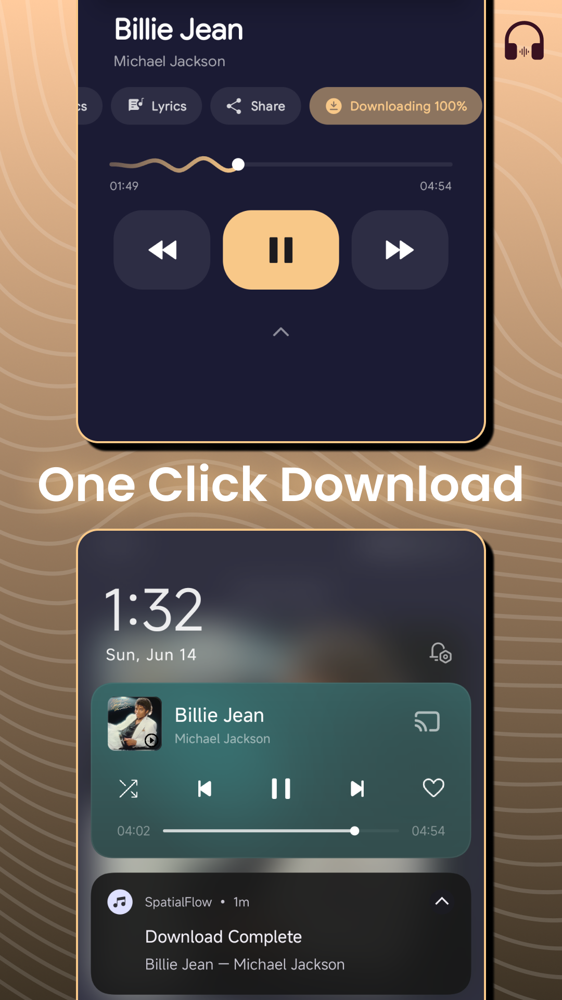

---

Architecture

SpatialFlow follows a modern MVI-inspired architecture focused on scalability, maintainability, and predictable state management.

Core Architecture Layers

Layer| Responsibility
Presentation| Jetpack Compose UI
State Management| ViewModel + StateFlow
Domain| Business Logic
Data| Repository Layer
Networking| Ktor Client
Playback| AndroidX Media3
Dependency Injection| Koin
Concurrency| Kotlin Coroutines

Design Principles

- Single Source of Truth
- Unidirectional Data Flow
- Reactive State Management
- Modular Feature Design
- Lifecycle-Aware Components
- Separation of Concerns
- Scalable Codebase Structure

---

Tech Stack

Component| Technology
Language| Kotlin 1.9+
UI Toolkit| Jetpack Compose
Design System| Material Design 3 Expressive
Architecture| MVI Inspired
Media Engine| AndroidX Media3
Networking| Ktor Client
Dependency Injection| Koin
Concurrency| Kotlin Coroutines
State Management| StateFlow
Image Loading| Coil

---

Requirements

Component| Version
Minimum SDK| 24 (Android 7.0)
Target SDK| 35
Java Version| JDK 17
Android Studio| Koala or Newer

---

Installation

Download APK

Download the latest stable release directly from GitHub Releases:

https://github.com/MythicalSHUB/SpatialFlow/releases

Build From Source

git clone https://github.com/MythicalSHUB/SpatialFlow.git

cd SpatialFlow

1. Open the project in Android Studio.
2. Allow Gradle Sync to complete.
3. Build and run on your device.

---

In-App Updater

SpatialFlow includes a built-in update system.

Features:

- GitHub Releases integration
- Automatic update checking
- Direct APK download support
- Native Android Package Installer integration
- Seamless update experience

---

Roadmap

Completed

- Local Audio Playback
- YouTube Music Streaming
- Dynamic Theming
- Material Design 3 Expressive UI
- Volume Normalization
- Equalizer Support
- Audio Effects
- In-App Updates

Planned

- Lyrics Support
- Android Auto
- Chromecast
- Playlist Backup & Sync
- Wear OS Companion
- Advanced Recommendation Engine
- Desktop Companion Application

---

Contributing

Contributions are welcome and appreciated.

To contribute:

1. Fork the repository
2. Create a feature branch
3. Commit your changes
4. Push your branch
5. Open a Pull Request

Please use GitHub Issues for:

- Bug Reports
- Feature Requests
- UI Suggestions
- Performance Improvements

---

Credits & Acknowledgements

SpatialFlow stands on the shoulders of incredible open-source projects.

Special thanks to:

- AndroidX Media3 (ExoPlayer)
- NewPipe Extractor
- Koin
- Ktor
- Coil
- InnerTune
- OuterTune
- PixelPlayer
- Material Design 3

Their work has greatly contributed to the Android open-source ecosystem.

---

Developer

Shubham Karande

Android Developer focused on building modern, high-performance, and open-source mobile experiences.

Interests

- Android Development
- Kotlin & Jetpack Compose
- Media Applications
- Audio Processing
- Material Design
- Open Source Software

---

  Built with ❤️ using Kotlin, Jetpack Compose, and Android Media3.

  If you enjoy SpatialFlow, consider giving the repository a ⭐

---

License

MIT License

Copyright (c) 2026 Shubham Karande

Permission is hereby granted, free of charge, to any person obtaining a copy of this software and associated documentation files to deal in the Software without restriction, including without limitation the rights to use, copy, modify, merge, publish, distribute, sublicense, and/or sell copies of the Software.

See the LICENSE file for complete details.

---

Keywords

SpatialFlow, Android Music Player, Jetpack Compose Music Player, Material You Audio Player, Media3 Player, ExoPlayer Android App, Open Source Music Player, Hybrid Streaming Music App, Kotlin Android Application, Volume Normalization, LUFS Audio Processing, Equalizer Android App, YouTube Music Client, Material Design 3 Expressive.